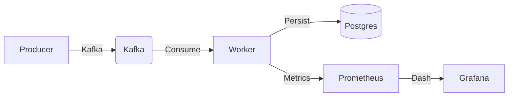
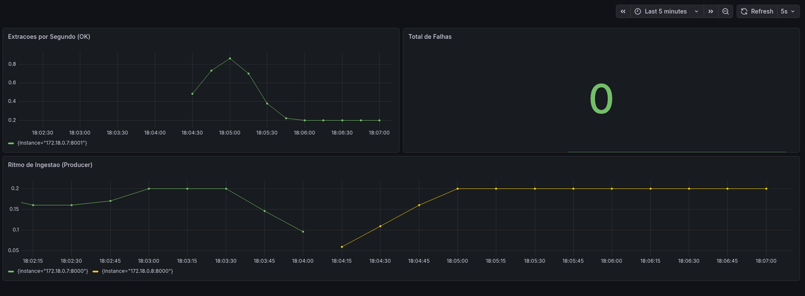
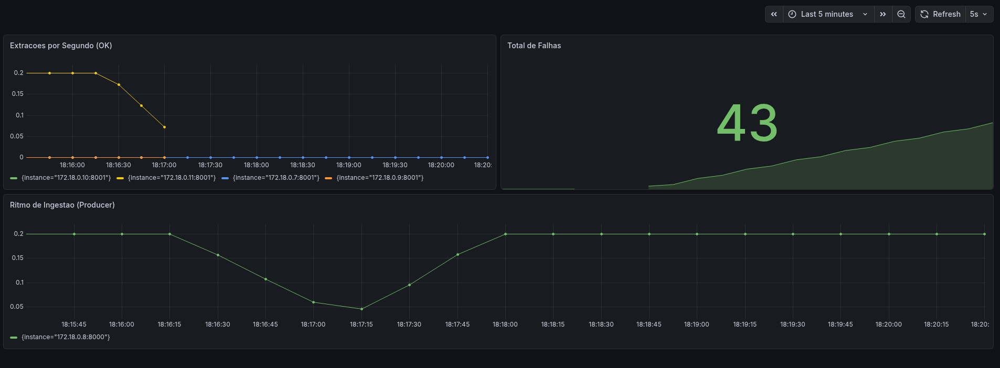
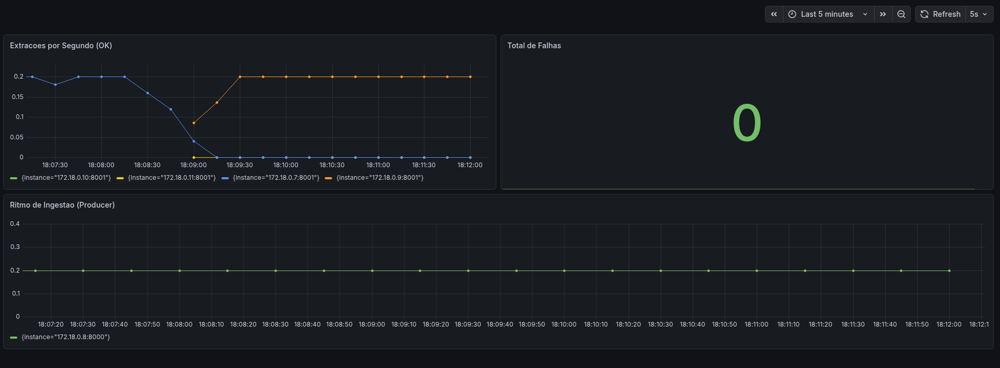

## 1. Arquitetura

A solução utiliza Event-Driven Architecture com Kafka e Postgres, dividida em dois ciclos de vida:


* Normal


* Erros

* Scaling



---

## 2. Executar

### Passo 1: Preparar a Rede
```bash
docker network create redecor-net
```

### Passo 2: Subir a Infraestrutura (Kafka, Postgres, Grafana)
```bash
( up option)
docker compose-f docker-compose.infra.yml up -d

(down option)
docker compose -f docker-compose.infra.yml down --remove-orphans

( remove option )
docker rm -f redecor-worker-3 producer 2>/dev/null || true

( prune option )
docker network prune -f

```

### Passo 3: Subir a Aplicação (Producer, Workers)

```bash
docker compose -f docker-compose.app.yml up -d --build
```

---

## 3. Validação

*  Visibilidade: `http://localhost:3000` (Grafana - Dashboard Automatico).
*  Escalabilidade: `docker compose -f docker-compose.app.yml up -d --scale worker=4`.
*  Persistencia: `docker exec -it postgres psql -U devops -d extractions -c "SELECT * FROM jobs LIMIT 10;"`.
*   **Kafka UI:** `http://localhost:8080`.

---

## 4. Estrutura de Configuração (.env)
*   `.env`: Configurações globais .
*   `app/producer/.env`: Ingestor.
*   `app/worker/.env`: Processador.


**Monitoring as Code:** Prometheus e Grafana são configurados via provisioning.
**Service Discovery:** O Prometheus descobre novas instâncias de workers automaticamente via DNS dinâmico do Docker.
**Resiliencia:** As aplicaçoes dependem estritamente das variaveis de ambiente ( possiel usar secret ) e possuem retry para aguardar a infraestrutura.

## 5. Stacks
* Orquestracao em :
```bash
swarm/
```

---
```bash
**todos os dados desse projeto sao apenas para demonstracao**
```
