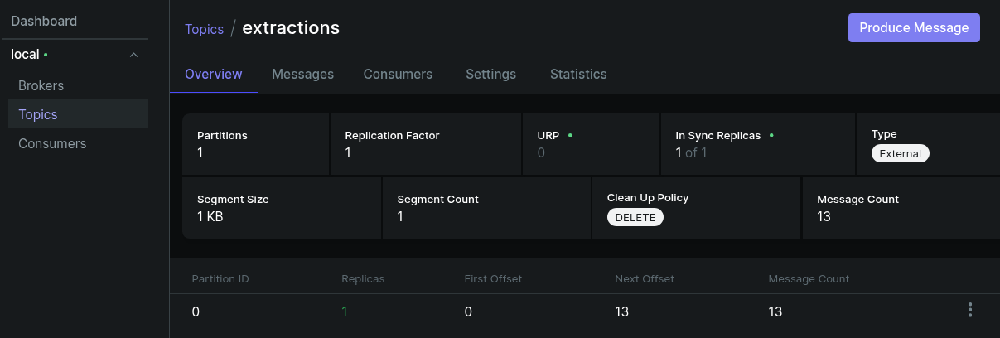

# Docker Swarm Autoscale:

- Kafka extractions


---
## 1
```bash
docker swarm init
env $(grep -v '^#' swarm/.env | xargs) docker stack deploy -c swarm/docker-stack.yml redecor
```

## 2
ou a sequencia correta:
```bash
docker build -t redecor-producer:latest ./app/producer
docker build -t redecor-worker:latest ./app/worker
docker build -t redecor-autoscaler:latest -f swarm/Dockerfile.autoscaler ./swarm
```
`docker config`  injeta o arquivo de configuraçao no Prometheus:
```bash
docker config create prometheus_config_v1 swarm/prometheus.yml
```

Suba todo o ecossistema (Infra + App + Autoscaler):
```bash
env $(grep -v '^#' swarm/.env | xargs) docker stack deploy -c swarm/docker-stack.yml redecor

```

---

## 3. Escalabilidade Automatica
O serviço `redecor_autoscaler` monitora o uso de CPU via Prometheus.

*   **Metrica:** `avg(rate(process_cpu_seconds_total{job="worker"}[1m])) * 100`

---

## 4. Observabilidade e uso
*   **Grafana:** `http://localhost:3000` .
*   **Prometheus:** `http://localhost:9090` .
*   **Kafka UI:** `http://localhost:8080`.
    ```bash
    docker service logs redecor_autoscaler
    ```

## 5. Provisionamento
*   **/terraform:**
```bash
Makefile
configs
Template
Setup.sh
```


---

- Possiveis configs:

```bash
docker stack rm redecor
docker config rm prometheus_config_v1
sudo chmod 666 /var/run/docker.sock
sudo chcon -t container_file_t /var/run/docker.sock
chmod 777 swarm/prometheus.yml
docker service update --force redecor_worker
```
